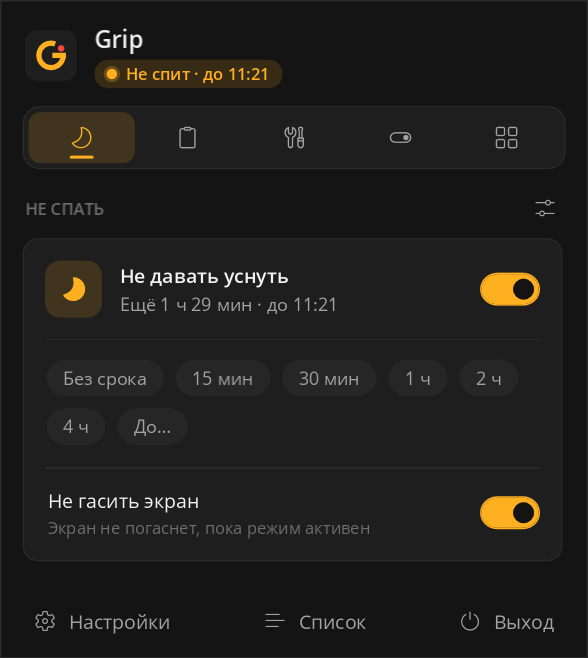
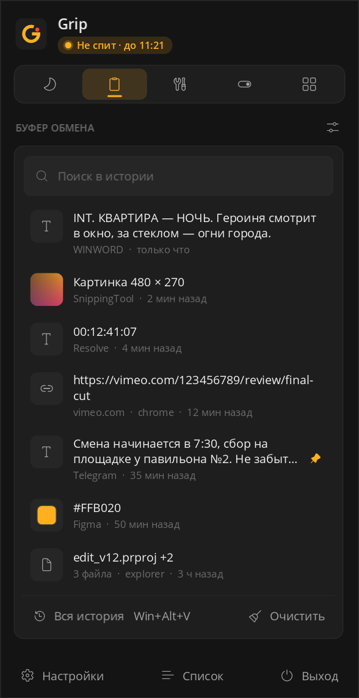
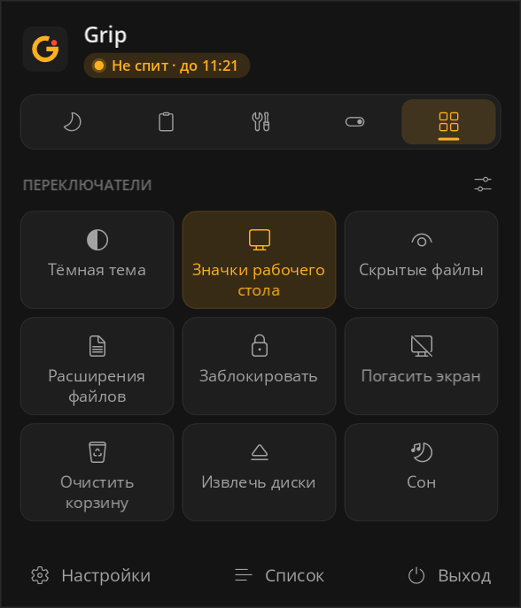
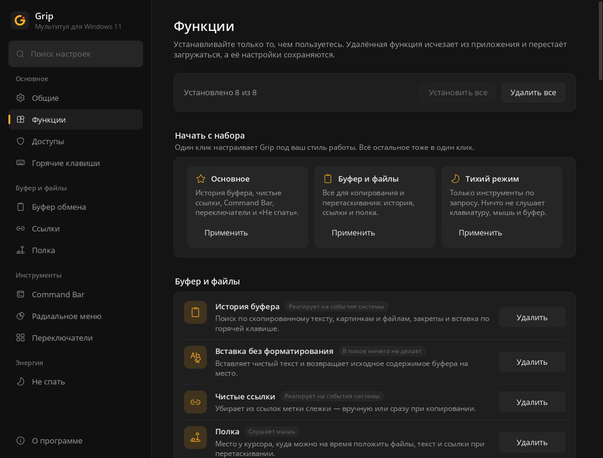
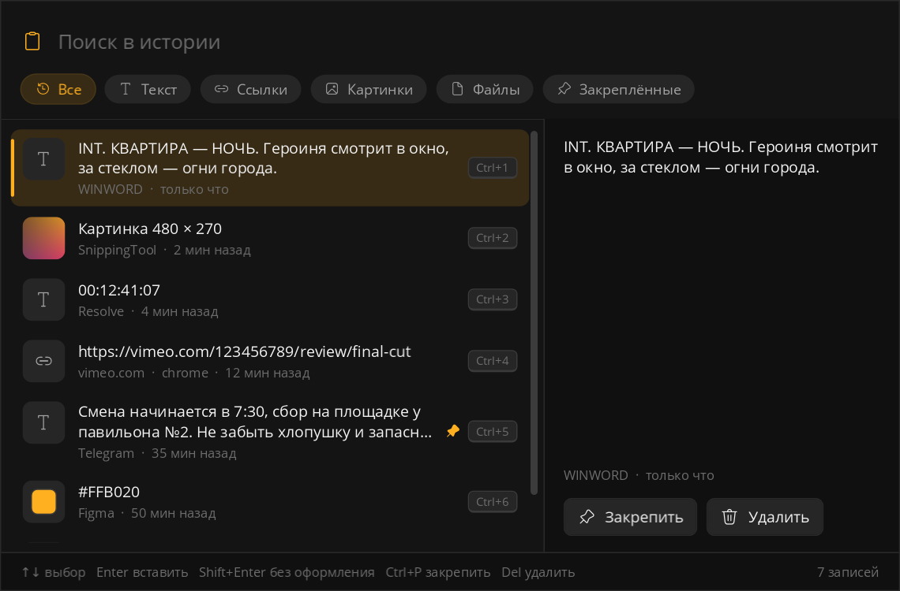
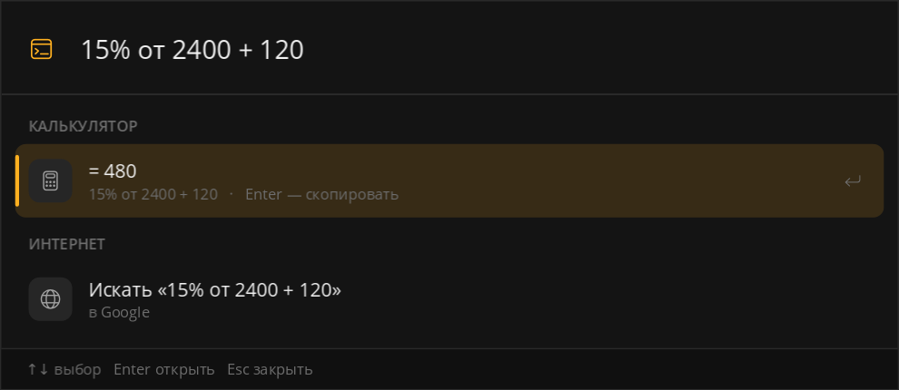
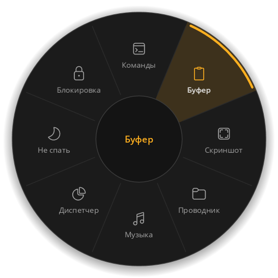
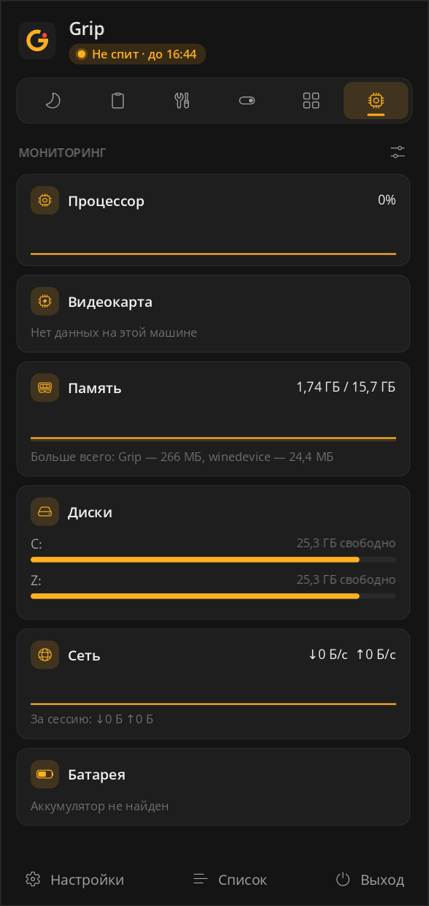

<p align="center">
  
</p>

<h1 align="center">Grip</h1>

<p align="center">
  Мультитул для Windows 11: всё полезное — за одним значком в трее.<br>
  Без аккаунтов, рекламы и слежки. Всё работает локально.
</p>

<p align="center">
  <a href="https://github.com/lizard5736/MT11/actions/workflows/build.yml"></a>
  
  
</p>

<p align="center">
  
  
  
</p>

Grip собирает в одну панель утилиты, которые на Windows обычно ставят по отдельности: историю буфера, командную строку для всего, радиальное меню, «полку» для перетаскивания, быстрые переключатели и режим «не спать». Идея и набор функций вдохновлены macOS-приложением [Vorssaint](https://github.com/vorssaint/vorssaint-utils). Grip — самостоятельный проект для Windows, код написан с нуля.

## Устанавливайте только то, чем пользуетесь

Каждую функцию можно установить или удалить в хабе «Функции». Удалённая функция исчезает из панели, настроек и горячих клавиш и перестаёт загружаться, а её настройки сохраняются. Для быстрого старта есть три набора: «Основное», «Буфер и файлы», «Тихий режим».

У каждой функции есть честная метка: что она держит в фоне, пока включена. Например, «В покое ничего не делает», «Слушает мышь» или «Реагирует на события системы».

<p align="center">
  
</p>

## Что умеет Grip

### Буфер и файлы
- **История буфера.** Текст, ссылки, картинки и файлы. Поиск, фильтры, закрепы, превью, Ctrl+1…9 и вставка в приложение, из которого вы открыли историю. Если скопирован цвет (`#FFB020`, `rgb(…)`), он показывается образцом.
- **Приватность.** Всё, что менеджеры паролей помечают как «не сохранять», в историю не попадает. Можно добавить свои приложения в исключения.
- **Автоочистка буфера** через заданное время, при блокировке и перед сном. История при этом сохраняется.
- **Вставка без форматирования.** Вставляет чистый текст и возвращает исходное содержимое буфера на место.
- **Чистые ссылки.** Убирает `utm_*`, `fbclid`, `gclid`, `yclid`, `si` и другие метки, раскрывает редиректы Google и ВКонтакте, упрощает ссылки на поиск. Работает вручную или сразу при копировании.
- **Полка.** Временное место для файлов, текста и ссылок. Открывается встряхиванием файла при перетаскивании или горячей клавишей.

<p align="center">
  
</p>

### Инструменты
- **Command Bar** (Alt+Space). Приложения из «Пуска», открытые окна, параметры Windows, действия Grip, история буфера, скрипты и поиск в интернете. Калькулятор понимает `15% от 2400 + 120`, `√16`, `3х4`, русскую запятую; конвертер — `10 км в милях`, `100f to c`, `1,5 гб в мб`. Эмодзи ищутся по-русски и по-английски, а если вы начали печатать не в той раскладке (`ыуеештпы`), Grip поймёт.
- **Радиальное меню** (Win+Alt+Q или кнопка мыши). Колесо действий вокруг курсора: профили, подменю, выбор отпусканием клавиши. Короткий клик кнопкой мыши работает как обычно.
- **Быстрые переключатели.** Тёмная тема, значки рабочего стола, скрытые файлы, расширения файлов, блокировка, выключение экрана, корзина, извлечение дисков, сон.

<p align="center">
  
  
</p>

### Мониторинг
- **Процессор, память, диски, сеть, батарея.** Загрузка CPU с графиком, занятая память и самые прожорливые процессы, свободное место на дисках, скорость сети и трафик с запуска Grip, заряд батареи. Видеокарта — загрузка через системные счётчики Windows, без вендорских SDK. Каждая метрика ставится и убирается отдельно, цифра краснеет при высокой нагрузке.

<p align="center">
  
</p>

### Окна
- **Раскладка окон.** Прижать активное окно — любое, не только Grip — к краю, трети, углу или во весь экран горячими клавишами, вернуть как было одной клавишей. Учитывает монитор, на котором окно сейчас находится.

### Энергия
- **Не спать.** Без срока, на 15 минут — 4 часа или до нужного времени. Экран можно не гасить. На ноутбуке — режим работы с закрытой крышкой: Grip возвращает настройку питания на место, даже если был закрыт аварийно.

### Оболочка
- Значок в трее и панель над панелью задач: вкладки или список, компактный режим, перестановка и скрытие разделов.
- Настройки с поиском по всем пунктам, единый список горячих клавиш с проверкой конфликтов.
- Тёмная тема «Графит» с янтарным акцентом и светлая тема. Русский и английский языки.
- Страница «Доступы»: что сейчас работает в фоне, права администратора, где лежат данные.
- Экспорт и импорт настроек для переноса на другой компьютер.

## Горячие клавиши по умолчанию

| Действие | Сочетание |
|---|---|
| Command Bar | `Alt` `Space` |
| История буфера | `Win` `Alt` `V` |
| Вставить без форматирования | `Ctrl` `Alt` `Shift` `V` |
| Радиальное меню | `Win` `Alt` `Q` |
| Полка | `Win` `Alt` `S` |
| Прижать окно влево / вправо | `Win` `Alt` `←` / `→` |
| Развернуть окно / вернуть как было | `Win` `Alt` `↑` / `↓` |
| Окно в угол экрана | `Win` `Alt` `U` `I` `J` `K` |
| Окно в треть экрана (лево / право) | `Win` `Alt` `,` / `.` |

Всё меняется в «Настройки → Горячие клавиши». Если сочетание уже занято другой программой, Grip покажет это прямо у поля.

## Установка

1. Скачайте `Grip.exe`. Откройте [последнюю успешную сборку](https://github.com/lizard5736/MT11/actions/workflows/build.yml) и внизу страницы, в блоке Artifacts, скачайте `Grip-win-x64`: это zip-архив, внутри — `Grip.exe`. Скачивание работает, если вы вошли в GitHub. Когда выйдут релизы, файл появится и на странице [Releases](https://github.com/lizard5736/MT11/releases).
2. Положите `Grip.exe` в постоянную папку, например `%LOCALAPPDATA%\Programs\Grip`, и запустите. Если потом перенести файл, автозапуск починится при следующем ручном запуске из нового места. .NET ставить не нужно, всё уже внутри файла.
3. У файла нет цифровой подписи, поэтому Windows может показать окно «Система Windows защитила ваш компьютер». Нажмите «Подробнее» → «Выполнить в любом случае».
4. Значок Grip появится в трее. Если его не видно, он в скрытой области за стрелкой `^`: перетащите его на панель задач.

**Удаление.** Выключите «Запускать вместе с Windows» в настройках, закройте Grip и удалите `Grip.exe`. Если настройки и история больше не нужны, удалите папки `%APPDATA%\Grip` и `%LOCALAPPDATA%\Grip`.

## Приватность

Настройки хранятся в `%APPDATA%\Grip`, история буфера — в `%LOCALAPPDATA%\Grip`. Grip не ходит в интернет, не собирает статистику и не требует аккаунта. В сеть уходят только ссылки, которые вы сами открываете (например, поиск из Command Bar).

## Дорожная карта

Grip растёт по этапам. Дальше — звук и мониторинг, окна и ввод, захват экрана и медиа, управление приложениями. Подробный план с тем, что переносится с macOS, что адаптируется под Windows и от чего отказались, — в [docs/ROADMAP.md](docs/ROADMAP.md). Что изменилось между версиями — в [CHANGELOG.md](CHANGELOG.md).

## Сборка из исходников

Нужен [.NET 10 SDK](https://dotnet.microsoft.com/download).

```powershell
dotnet test tests/Grip.Core.Tests                            # тесты логики
dotnet publish src/Grip/Grip.csproj -c Release -r win-x64 -o publish   # один Grip.exe
publish\Grip.exe --render-previews previews                   # PNG всех экранов с демо-данными
```

Структура:

| Папка | Что внутри |
|---|---|
| `src/Grip.Core` | Логика без зависимостей от Windows: каталог функций, настройки, история буфера, очистка ссылок, калькулятор, конвертер, поиск, локализация |
| `src/Grip` | Приложение WPF: трей, панель, окна инструментов, сервисы WinAPI |
| `tests/Grip.Core.Tests` | Тесты логики (xUnit) |
| `tools` | Генераторы иконок и проверки строк и ресурсов |

## Сторонние компоненты

- Иконки — [Fluent UI System Icons](https://github.com/microsoft/fluentui-system-icons) © Microsoft, лицензия MIT.
- MVVM — [CommunityToolkit.Mvvm](https://github.com/CommunityToolkit/dotnet) © .NET Foundation, лицензия MIT.
